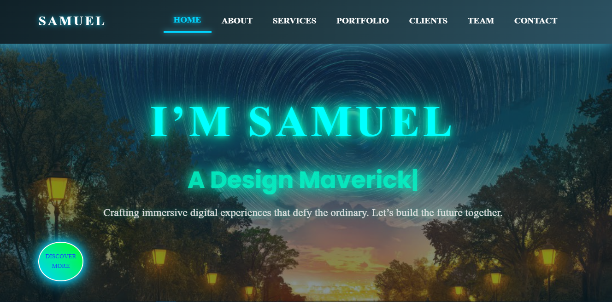

Samuel Nugusu Portfolio Website

Welcome to my personal portfolio website—a futuristic showcase of my skills, projects, and creativity. Built with a bold, neon-lit design inspired by "impossible" aesthetics, this site highlights my expertise in web development, UI/UX design, and digital innovation.

Overview
This portfolio is a single-page application designed to captivate visitors with dynamic animations, glowing effects, and a sleek, modern layout. It’s fully responsive and optimized for all devices, reflecting my passion for pushing the boundaries of digital experiences.

Features
Navbar: Animated, glowing navigation with neon hover effects.
Header: Futuristic cityscape background with 3D text, neon typing animation, and a call-to-action button.
About: Neon progress bars, a glowing profile image, and a bold bio.
Services: Interactive cards with neon icons and hover animations.
Portfolio: Filterable project gallery with 3D-hover cards and neon overlays.
Clients: Animated counters and a neon-lit testimonials carousel.
Team: Glowing team cards with flipping social link overlays.
Contact: Neon-styled form with glowing inputs and animated contact info.
Footer: Futuristic branding with flickering text and neon social links.
Back-to-Top: A glowing rocket button with hover animations for smooth scrolling.
Technologies Used
HTML5: Structure and semantics.
CSS3: Custom styles, animations, and neon effects.
Bootstrap 5: Responsive grid and carousel components.
jQuery: Dynamic animations (typing, counters, filtering).
AOS (Animate on Scroll): Subtle scroll-triggered animations.
Font Awesome: Iconography for services, team, and contact.
PHP: Basic form submission handling (requires server setup).
Folder Structure
text

Portfolio-Website/
├── assets/
│   ├── css/
│   │   ├── bootstrap.min.css
│   │   ├── all.min.css
│   │   └── style.css
│   ├── js/
│   │   ├── bootstrap.bundle.min.js
│   │   ├── jquery.min.js
│   │   └── index.js
│   ├── imgs/
│   │   ├── favicon.ico
│   │   ├── hero.jpg
│   │   ├── portfolio/
│   │   │   ├── 1.jpg
│   │   │   └── 2.jpg
│   │   └── team/
│   │       ├── 1.jpg
│   │       └── 2.jpg
├── php/
│   └── contact.php
└── index.html
└── README.md
assets/css/: Stylesheets, including custom style.css for the futuristic design.
assets/js/: Scripts for interactivity and animations.
assets/imgs/: Images for favicon, profile, portfolio, and team.
php/: Backend script for contact form (requires server-side setup).
index.html: Main file containing the site structure.
Setup Instructions
Prerequisites
A modern web browser (e.g., Chrome, Firefox).
A local server (e.g., XAMPP, MAMP) for testing the contact form (optional).
Basic knowledge of HTML, CSS, and JavaScript.
Local Setup
Clone or Download:
Clone this repository: git clone <https://github.com/yourusername/portfolio-website.git>
Or download the ZIP file and extract it.
Place Files:
Move the Portfolio-Website folder to your local directory or server root (e.g., htdocs for XAMPP).
Add Images:
Place favicon.ico and hero.jpg in assets/imgs/.
Add portfolio images (1.jpg, 2.jpg) to assets/imgs/portfolio/.
Add team images (1.jpg, 2.jpg) to assets/imgs/team/.
Run Locally:
Open index.html in a browser for static testing.
For the contact form, start a local server (e.g., <http://localhost/Portfolio-Website/>) and update contact.php with your email.
Deployment
GitHub Pages (Static Hosting)
Push the repository to GitHub.
Go to Settings > Pages, set the branch to main and folder to / (root).
Access your site at <https://yourusername.github.io/portfolio-website/>.
Note: The contact form won’t work; use a service like Formspree instead.
Web Hosting (PHP Support)
Upload all files to your hosting provider’s public_html directory via FTP (e.g., FileZilla).
Update contact.php with your email in the $to variable.
Test the site at your domain (e.g., yourdomain.com).
Customization
Images: Replace placeholders in assets/imgs/ with your own photos.
Content: Edit text in index.html (e.g., bio, services, team names).
Colors: Modify #00ffcc (neon cyan) in style.css for a different vibe.
Animations: Adjust keyframes or timing in style.css to tweak effects.
Credits
Bootstrap: getbootstrap.com
jQuery: jquery.com
Font Awesome: fontawesome.com
AOS: michalsnik.github.io/aos/
Background Image: Unsplash (Header cityscape)
Design Inspiration: "Impossible" website aesthetics.
Contact
For questions or collaboration, reach out:

Email: <samuelnugusu@example.com>
LinkedIn: linkedin.com/in/yourprofile
GitHub: github.com/yourusername
How to Use This README
Create the File:
Open a text editor (e.g., VS Code, Notepad).
Copy the above content into a new file.
Save it as README.md in the root of your Portfolio-Website folder.
Customize:
Replace placeholders (e.g., yourusername, <samuelnugusu@example.com>) with your actual details.
Add a screenshot by capturing your site, saving it as portfolio-screenshot.jpg in assets/imgs/, and updating the image path.
Push to GitHub (Optional):
Initialize a Git repository: git init
Add files: git add .
Commit: git commit -m "Initial portfolio commit"
Push: git push origin main (after setting up a remote repository).
Feedback:
Does this README cover everything you need?
Want to add more sections (e.g., a "Future Improvements" list)?
Ready to deploy now, or need more tweaks?
